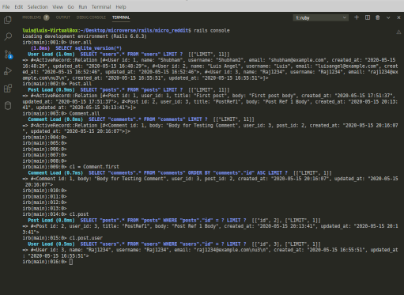

# Micro-Reddit

In this project, we are building a "Junior [Reddit](http://reddit.com/)" using Active Record to build databases that will allow us to create users, posts, and comments for the posts. We also created the appropriate associations amongst them to link each one with its respective other. Finally, added validations for each one of them to guaranty the users are not providing any incorrect information.



# Requirements

- Ruby > 2.6.5
- Rails > 6.0.1

## Getting Started

To get started with the app, cd to the directory where you would like the repo to live by typing on your terminal:

```
$ cd <directory>
```

Clone the repo typing:

```
$ git clone https://github.com/shubham14p3/micro_reddit.git
```

Install the needed gems:

```
$ bundle install
```

Finally, migrate the database:

```
$ rails db:migrate
```

## Built With

- Ruby
- Rails
- VSCode

## Authors

👤 **Luis Angel Maldonado**

- Github: [@lmaldonadoch](https://github.com/lmaldonadoch)
- Twitter: [@LuisAngelMCh](https://twitter.com/LuisAngelMCh)
- Linkedin: [linkedin](https://www.linkedin.com/in/lmaldonadoch)

👤 Shubham Raj

- Github: [@ShubhamRaj](https://github.com/shubham14p3)
- Linkedin: [Shubham14p3](https://www.linkedin.com/in/shubham14p3/)

## 🤝 Contributing

Contributions, issues and feature requests are welcome!

Feel free to check the [issues page](https://github.com/shubham14p3/micro_reddit/issues/).

## Acknowledgement

- Project requested by [Microverse Program](https://www.microverse.org/).
- Original project from [The Odin Project](https://www.theodinproject.com/courses/ruby-on-rails/lessons/building-with-active-record-ruby-on-rails).
- Idea taken from [Reddit](http://reddit.com/) website.

## Show your support

Give a ⭐️ if you like this project!
